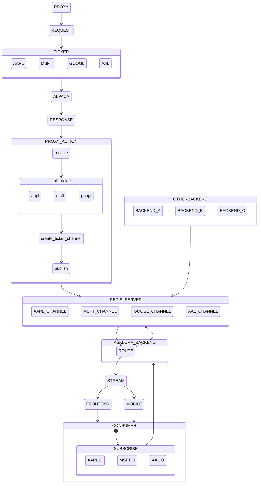

# STREAM PROXY FOR MARKET PRICE :
## requirements:
- python 3.10.1
- linux os
- redis server

### explaination:
the proxy server will request all asklora USD ticker to alpaca in one channel. stream response from alpaca will be managed by proxy server and create channel in redis server using pubsub for each ticker. pubsub is real time publish and receive data  
 
Backend will manage the request from apps/user/consumer. if consumer or other backends needs streaming data we are not making new request to alpaca, instead we route it to stock channel in Redis Server. each consumer/backends can subcribe as many channel they want to listen. could be user favorite list of stock , list asklora topstock , all stock.
 
## Supported Channel:
- &check; Quotes
- &#9746; Trades
- &#9746; News
- &#9746; stock status

