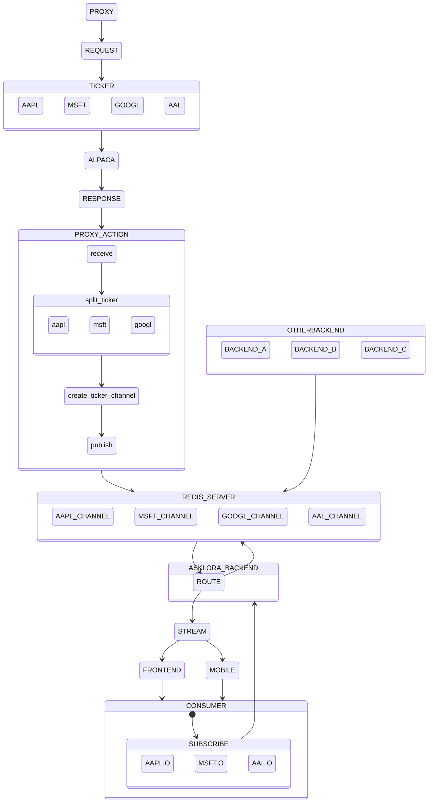

# STREAM PROXY FOR MARKET PRICE :
## short off multithreading vs multiprocessing vs concurrent.future vs asyncio
 
in this repo we are often using asyncio library because lot of incoming data at same time we write to redis, we have to make sure there are non blocking process when data arrive and send it to redis except something error happens. instead using primitive multithreading and multiprocessing we are using asyncio library which is modern wrapper for those tools and do the magic for us. here short explaintion about
 

- *threading:* interface to OS-level threads. Note that CPU-bound work is mostly serialized by the GIL, so don't expect speedup in your calculations. Use it when you need to invoke blocking APIs in parallel, and when you require precise control over thread creation. Avoid creating too many threads (e.g. thousands), as they are not free. If possible, don't create threads yourself, use concurrent.futures instead.

- *multiprocessing:* interface to spawning multiple python processes with an API intentionally similar to threading. Multiple processes work in parallel, so you can actually speed up calculations using this method. The disadvantage is that you can't share in-memory datastructures without using multi-processing specific tools.

- *concurrent.futures*: A modern interface to threading and multiprocessing, which provides convenient thread/process pools it calls executors. The pool's main entry point is the submit method which returns a handle that you can test for completion or wait for its result. Getting the result gives you the return value of the submitted function and correctly propagates raised exceptions (if any), which would be tedious to do with threading. concurrent.futures should be the tool of choice when considering thread or process based parallelism.

- *asyncio:* While the previous options are "async" in the sense that they provide non-blocking APIs (this is what methods like apply_async refer to), they are still relying on thread/process pools to do their magic, and cannot really do more things in parallel than they have workers in the pool. Asyncio is different: it uses a single thread of execution and async system calls across the board. It has no blocking calls at all, the only blocking part being the asyncio.run() entry point. Asyncio code is typically written using coroutines, which use await to suspend until something interesting happens. (Suspending is different than blocking in that it allows the event loop thread to continue to other things while you're waiting.) It has many advantages compared to thread-based solutions, such as being able to spawn thousands of cheap "tasks" without bogging down the system, and being able to cancel tasks or easily wait for multiple things at once. Asyncio should be the tool of choice for servers and for clients connecting to multiple servers.
## requirements:
- python 3.10.1
- linux os
- redis server

### explaination:
the proxy server will request all asklora USD ticker to alpaca in one channel. stream response from alpaca will be managed by proxy server and create channel in redis server using pubsub for each ticker. pubsub is real time publish and receive data  
 
Backend will manage the request from apps/user/consumer. if consumer or other backends needs streaming data we are not making new request to alpaca, instead we route it to stock channel in Redis Server. each consumer/backends can subcribe as many channel they want to listen. could be user favorite list of stock , list asklora topstock , all stock.
 
## Supported Channel:
- &check; Quotes
- &#9746; Trades
- &#9746; News
- &#9746; stock status

